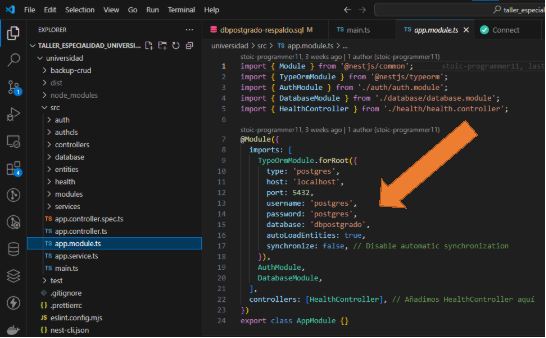
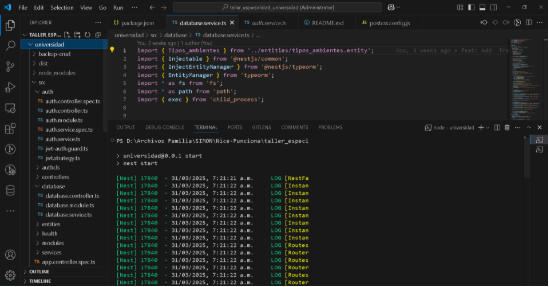
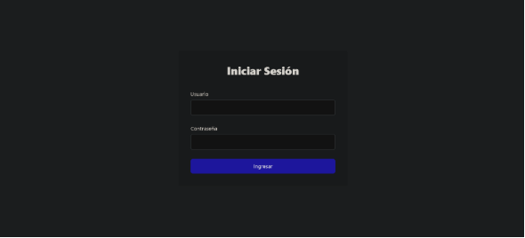
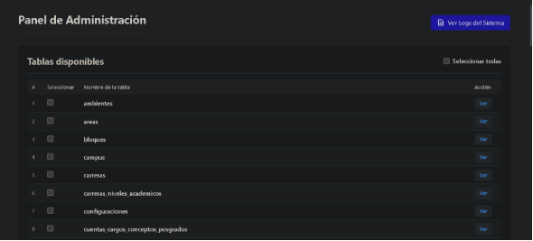
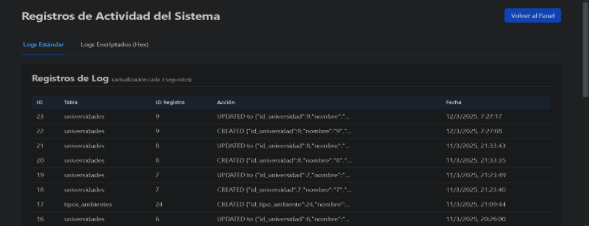
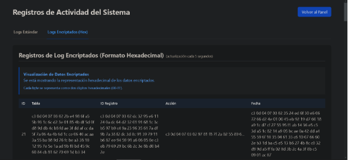

**Universidad - Guía de Instalación y Uso**

Este proyecto consiste en una aplicación de gestión para universidades con un backend en NestJS y un frontend en React.

**Requisitos del sistema:**

- Node.js (versión recomendada: 21.x o superior)
- PostgreSQL (base de datos)
- npm o yarn

**Estructura del proyecto**

  El proyecto está compuesto por dos partes principales:

- **universidad**: Backend (API REST en NestJS)
- **universidad-frontend**: Frontend (Aplicación en React)

  **Instalación**

1. **Crea la base de datos "dbpostgrado", luego ejecutar el script de respaldo "dbpostgrado-respaldo.sql"**


2. **Navega a la carpeta "universidad" y instala las dependencias:**

```bash
cd universidad
npm install
```

3. **Actualizar datos en base a tu configuracion postgres**



4. **Ejecuta el servidor:**

```bash
npm run start
```

**Debera ver la siguiente pantalla:**



**Frontend (React)**

 5. **Abre otra terminal y navega a la carpeta del frontend y instala las dependencias:**

```bash
cd universidad-frontend
npm install
```

 6. **Ejecuta la aplicación React:**

```bash
npm start
```



**Deberá ver el login y ingresar con las credenciales predeterminadas "admin" y contraseña "123456":**

Y luego tenemos acceso al Panel de Administración:


**Uso básico**

1. Accede al frontend a través de http://localhost:3000
2. Inicia sesión con las credenciales predeterminadas
3. Navega por la interfaz para gestionar los distintos módulos universitarios


#
# **Análisis de la base de datos universitaria con sistema de logging**
## **Descripción General de la Base de Datos**
Esta base de datos PostgreSQL está diseñada para gestionar una universidad con énfasis en programas de postgrado. Es un sistema bastante completo que maneja desde la estructura física de la universidad (campus, edificios) hasta aspectos académicos y financieros, especialmente de programas de postgrado.
## **Componentes Principales**
- **Estructura organizativa**: Universidades, facultades, carreras, áreas
- **Infraestructura física**: Campus, edificios, bloques, pisos, ambientes
- **Actores**: Personas (estudiantes, docentes, administrativos, decanos)
- **Académico**: Programas, materias, calificaciones, asignaciones
- **Financiero**: Cuentas, conceptos, contratos, transacciones
- **Seguridad y usuarios**: Usuarios, roles, menus
## **Sistema de Logging**
La base de datos implementa un sofisticado sistema de auditoría dual que registra cambios en tablas mediante:
### **1. log\_table**
Almacena registros en texto plano sobre operaciones CRUD en las tablas:

- id: Identificador único del registro de log
- table\_name: Nombre de la tabla modificada
- id\_registro\_tabla\_modificada: ID del registro afectado
- action: Descripción de la operación (CREATED, UPDATED, DELETED)
- date: Fecha y hora de la modificación
### **2. encrypted\_log\_table**
Versión encriptada del log que utiliza funciones criptográficas:

- Mismos campos que log\_table pero almacenados como bytea (datos binarios)
- Los datos se encriptan usando la función encrypt\_text() y una clave ("maquina")
- Se pueden desencriptar con la función decrypt\_text()


### **Trigger System: log\_changes()**
El corazón del sistema de logging es la función log\_changes(), que:

1. Se activa automáticamente mediante triggers al realizar cambios en tablas
1. Identifica qué tipo de operación se está realizando (INSERT, UPDATE, DELETE)
1. Obtiene la clave primaria del registro afectado
1. Registra simultáneamente en ambas tablas de log:
   1. En log\_table en formato legible
   1. En encrypted\_log\_table en formato encriptado usando pgcrypto
1. Incluye detalles como la estructura JSON del registro antes/después del cambio

La función utiliza la extensión pgcrypto para cifrar simétrico:

- encrypt\_text(): Encripta texto usando PGP con clave simétrica
- decrypt\_text(): Desencripta texto cifrado, manejando errores elegantemente

### Este sistema dual proporciona tanto accesibilidad inmediata (logs en texto plano) como seguridad (logs encriptados) para proteger la integridad de los datos de auditoría contra manipulaciones.

# LOG DE ACTIVIDADES 



# LOG DE ACTIVIDADES ENCRIPTADO



